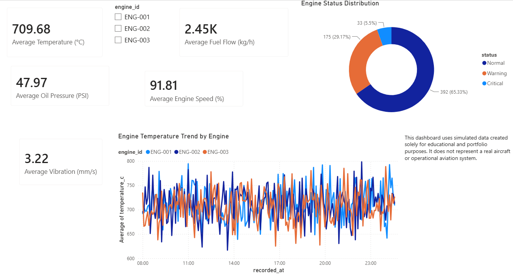

# Aircraft Engine Monitoring

An educational data analytics project demonstrating aircraft-engine condition monitoring using Python, SQL Server and Power BI.



## Project Overview

This project analyses simulated aircraft-engine sensor readings to identify normal, warning and critical operating conditions. It demonstrates an end-to-end data workflow from data generation and database storage to interactive dashboard reporting.

## Technologies Used

* Python
* SQL Server
* Power BI
* CSV
* GitHub

## Dataset

The Python script generates 600 simulated sensor readings for three engines:

* ENG-001
* ENG-002
* ENG-003

The dataset contains:

* Recorded date and time
* Engine temperature
* Oil pressure
* Vibration
* Fuel flow
* Engine speed
* Flight hours
* Operational status
* Maintenance requirement

## Project Workflow

1. Python generates the simulated engine readings.
2. The data is saved as a CSV file.
3. SQL Server stores and queries the dataset.
4. Power BI connects to SQL Server.
5. The dashboard presents engine-condition indicators and trends.

## Dashboard Features

* Average engine temperature
* Average oil pressure
* Average vibration
* Average fuel flow
* Average engine speed
* Engine selector
* Normal, warning and critical status distribution
* Temperature trends for three engines

## Key Results

The dataset contains 600 readings:

* Normal: 392 readings
* Warning: 175 readings
* Critical: 33 readings

The dashboard allows users to select an individual engine and examine its measurements, status distribution and temperature trend.

## Repository Structure

```text
Aircraft-Engine-Monitoring
├── data
│   └── aircraft_engine_data.csv
├── powerbi
│   └── Aircraft_Engine_Monitoring_Dashboard.pbix
├── python
│   └── generate_engine_data.py
├── screenshots
│   └── Aircraft_Engine_Monitoring_Dashboard.png
├── sql
│   └── create_database.sql
├── LICENSE
└── README.md
```

## Disclaimer

This project uses simulated data created solely for educational and portfolio purposes. It does not represent a real aircraft, engine manufacturer or operational aviation system.

## Author

Rajakokila Muralitharan
GitHub: [Rajakokila-P](https://github.com/Rajakokila-P)
